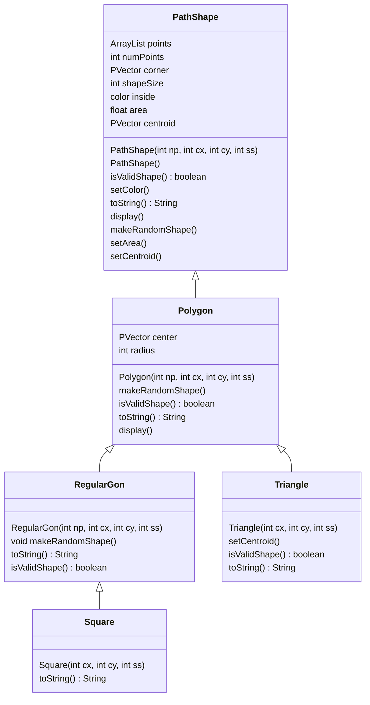

```mermaid
classDiagram
    class PathShape {
        ArrayList<PVector> points
        int numPoints
        PVector corner
        int shapeSize
        color inside
        float area
        PVector centroid

        PathShape(int np, int cx, int cy, int ss)
        PathShape()

        isValidShape() boolean
        setColor()
        toString() String
        display()
        makeRandomShape()
        setArea()
        setCentroid()
    }

    PathShape <|-- Polygon
    class Polygon {
        PVector center
        int radius

        Polygon(int np, int cx, int cy, int ss)
        makeRandomShape()

        isValidShape() boolean
        toString() String
        display()
    }

    Polygon <|-- RegularGon
    class RegularGon {
        RegularGon(int np, int cx, int cy, int ss)
        void makeRandomShape()
        toString() String
        isValidShape() boolean
    }

    Polygon <|-- Triangle
    class Triangle {
        Triangle(int cx, int cy, int ss)
        setCentroid()
        isValidShape() boolean
        toString() String
    }

    RegularGon <|-- Square
    class Square {
        Square(int cx, int cy, int ss)
        toString() String
    }
```
